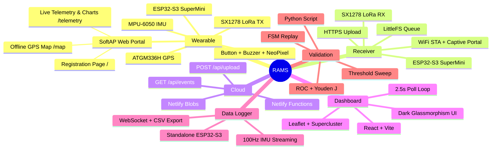
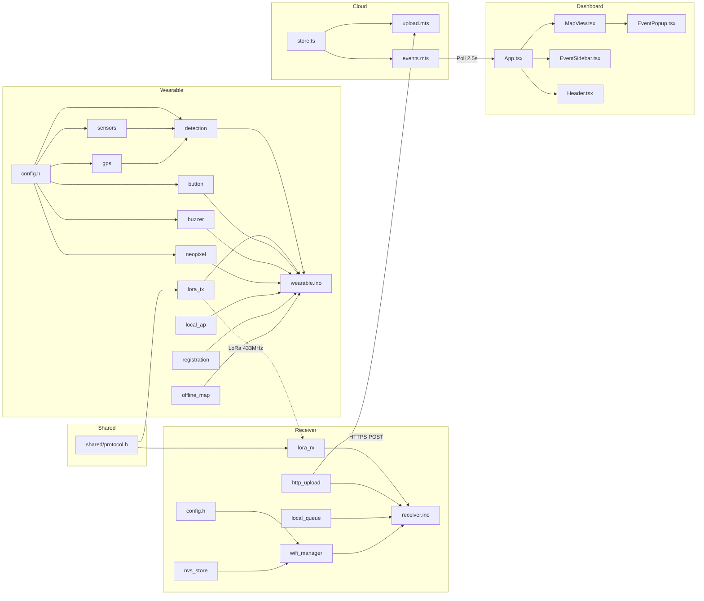
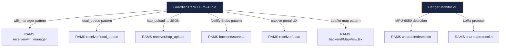
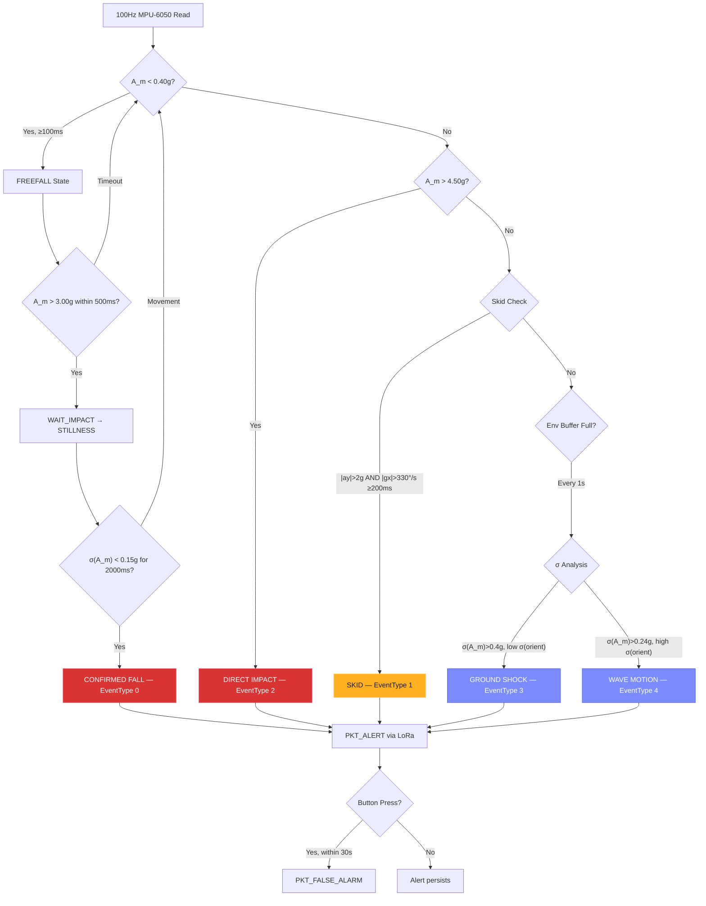

# Road Accident Monitoring System — Knowledge Graph

> **PGC Digital Innovation Challenge 2026**  
> Version: v2 (evolved from "Danger Monitoring System" v1)  
> GitHub: https://github.com/JanClyde05/Road-Accident-Monitoring-System  
> Dashboard: https://road-accident-monitoring-system.netlify.app  
> **Master Obsidian Memory Map**: [[RAMS_OBSIDIAN_MEMORY_MAP.md]] | Root: [[MEMORY_MAP.md]]  
> **Design Specification**: [[DESIGN_RULES.md]]

---

## 🧠 System Identity Map

---

## 📁 File Inventory (46 files total)

### shared/ (1 file)
| File | Purpose | Dependencies |
|------|---------|-------------|
| [protocol.h](file:///d:/Antigravity/Projects/Danger%20Monitoring%20System%20V2/shared/protocol.h) | LoRa packet structs, enums, radio constants | None — consumed by wearable + receiver |

### wearable/ (23 files)
| File | Purpose | Key Dependencies |
|------|---------|-----------------|
| [config.h](file:///d:/Antigravity/Projects/Danger%20Monitoring%20System%20V2/wearable/config.h) | Pin map, detection thresholds, timing constants | — |
| [sensors.h](file:///d:/Antigravity/Projects/Danger%20Monitoring%20System%20V2/wearable/sensors.h) / [.cpp](file:///d:/Antigravity/Projects/Danger%20Monitoring%20System%20V2/wearable/sensors.cpp) | MPU-6050 driver + calibration | Wire.h, config.h |
| [gps.h](file:///d:/Antigravity/Projects/Danger%20Monitoring%20System%20V2/wearable/gps.h) / [.cpp](file:///d:/Antigravity/Projects/Danger%20Monitoring%20System%20V2/wearable/gps.cpp) | ATGM336H via TinyGPS++ | TinyGPSPlus, config.h |
| [detection.h](file:///d:/Antigravity/Projects/Danger%20Monitoring%20System%20V2/wearable/detection.h) / [.cpp](file:///d:/Antigravity/Projects/Danger%20Monitoring%20System%20V2/wearable/detection.cpp) | ★ Core FSM: Fall/Skid/Impact/Environmental | sensors, gps, config.h |
| [lora_tx.h](file:///d:/Antigravity/Projects/Danger%20Monitoring%20System%20V2/wearable/lora_tx.h) / [.cpp](file:///d:/Antigravity/Projects/Danger%20Monitoring%20System%20V2/wearable/lora_tx.cpp) | LoRa packet transmission | LoRa.h, shared/protocol.h |
| [button.h](file:///d:/Antigravity/Projects/Danger%20Monitoring%20System%20V2/wearable/button.h) / [.cpp](file:///d:/Antigravity/Projects/Danger%20Monitoring%20System%20V2/wearable/button.cpp) | Debounced button, short/long press | config.h |
| [buzzer.h](file:///d:/Antigravity/Projects/Danger%20Monitoring%20System%20V2/wearable/buzzer.h) / [.cpp](file:///d:/Antigravity/Projects/Danger%20Monitoring%20System%20V2/wearable/buzzer.cpp) | Non-blocking alert tone patterns | config.h |
| [neopixel.h](file:///d:/Antigravity/Projects/Danger%20Monitoring%20System%20V2/wearable/neopixel.h) / [.cpp](file:///d:/Antigravity/Projects/Danger%20Monitoring%20System%20V2/wearable/neopixel.cpp) | Status LED colors + SOS flash | Adafruit_NeoPixel, config.h |
| [local_ap.h](file:///d:/Antigravity/Projects/Danger%20Monitoring%20System%20V2/wearable/local_ap.h) / [.cpp](file:///d:/Antigravity/Projects/Danger%20Monitoring%20System%20V2/wearable/local_ap.cpp) | SoftAP + WebSocket (setup mode: `/` Registration, `/map` Offline Map, `/telemetry` Live Charts) | WiFi.h, WebSocketsServer, ESPAsyncWebServer |
| [registration.h](file:///d:/Antigravity/Projects/Danger%20Monitoring%20System%20V2/wearable/registration.h) / [.cpp](file:///d:/Antigravity/Projects/Danger%20Monitoring%20System%20V2/wearable/registration.cpp) | Name + Drive link → token, NVS storage | ArduinoJson, Preferences |
| [offline_map.h](file:///d:/Antigravity/Projects/Danger%20Monitoring%20System%20V2/wearable/offline_map.h) / [.cpp](file:///d:/Antigravity/Projects/Danger%20Monitoring%20System%20V2/wearable/offline_map.cpp) | GPS-to-pixel static map viewer | map_image.h |
| [preview_registration.html](file:///d:/Antigravity/Projects/Danger%20Monitoring%20System%20V2/wearable/preview_registration.html) | Standalone local browser preview (WebSocket + category selector) | data/style.css |
| [wearable.ino](file:///d:/Antigravity/Projects/Danger%20Monitoring%20System%20V2/wearable/wearable.ino) | Main orchestrator (armed/setup modes) | All above modules |
| [data/index.html](file:///d:/Antigravity/Projects/Danger%20Monitoring%20System%20V2/wearable/data/index.html) | LittleFS single-page application (4 views, category selector) | style.css, app.js |
| [data/style.css](file:///d:/Antigravity/Projects/Danger%20Monitoring%20System%20V2/wearable/data/style.css) | LittleFS styling (circular logo, custom teardrop pin, dark slate) | — |
| [data/app.js](file:///d:/Antigravity/Projects/Danger%20Monitoring%20System%20V2/wearable/data/app.js) | LittleFS WebSocket client (hash token, category sync, Tuguegarao map) | — |
| [data/map.html](file:///d:/Antigravity/Projects/Danger%20Monitoring%20System%20V2/wearable/data/map.html) | Standalone Tuguegarao City vector map route | style.css, app.js |
| [data/telemetry.html](file:///d:/Antigravity/Projects/Danger%20Monitoring%20System%20V2/wearable/data/telemetry.html) | Standalone live IMU/GPS telemetry route | style.css, app.js |
| [data/logo.png](file:///d:/Antigravity/Projects/Danger%20Monitoring%20System%20V2/wearable/data/logo.png) | Secondary raster emblem asset | — |

### receiver/ (16 files)
| File | Purpose | Key Dependencies |
|------|---------|-----------------|
| [config.h](file:///d:/Antigravity/Projects/Danger%20Monitoring%20System%20V2/receiver/config.h) | Backend URL, retry settings, pin map | — |
| [nvs_store.h](file:///d:/Antigravity/Projects/Danger%20Monitoring%20System%20V2/receiver/nvs_store.h) / [.cpp](file:///d:/Antigravity/Projects/Danger%20Monitoring%20System%20V2/receiver/nvs_store.cpp) | WiFi credential persistence | Preferences |
| [wifi_manager.h](file:///d:/Antigravity/Projects/Danger%20Monitoring%20System%20V2/receiver/wifi_manager.h) / [.cpp](file:///d:/Antigravity/Projects/Danger%20Monitoring%20System%20V2/receiver/wifi_manager.cpp) | Captive portal WiFi provisioning | ESPAsyncWebServer, LittleFS, DNSServer |
| [lora_rx.h](file:///d:/Antigravity/Projects/Danger%20Monitoring%20System%20V2/receiver/lora_rx.h) / [.cpp](file:///d:/Antigravity/Projects/Danger%20Monitoring%20System%20V2/receiver/lora_rx.cpp) | LoRa packet receive + deserialize | LoRa.h, shared/protocol.h |
| [http_upload.h](file:///d:/Antigravity/Projects/Danger%20Monitoring%20System%20V2/receiver/http_upload.h) / [.cpp](file:///d:/Antigravity/Projects/Danger%20Monitoring%20System%20V2/receiver/http_upload.cpp) | HTTPS POST JSON to Netlify | HTTPClient, WiFiClientSecure |
| [local_queue.h](file:///d:/Antigravity/Projects/Danger%20Monitoring%20System%20V2/receiver/local_queue.h) / [.cpp](file:///d:/Antigravity/Projects/Danger%20Monitoring%20System%20V2/receiver/local_queue.cpp) | LittleFS store-and-retry buffer | LittleFS |
| [receiver.ino](file:///d:/Antigravity/Projects/Danger%20Monitoring%20System%20V2/receiver/receiver.ino) | Main orchestrator | All above modules |
| [preview_receiver.html](file:///d:/Antigravity/Projects/Danger%20Monitoring%20System%20V2/receiver/preview_receiver.html) | Standalone local browser preview (circular logo + mock AP) | data/style.css |
| [data/index.html](file:///d:/Antigravity/Projects/Danger%20Monitoring%20System%20V2/receiver/data/index.html) | Captive portal page (LittleFS, circular logo) | style.css, app.js |
| [data/style.css](file:///d:/Antigravity/Projects/Danger%20Monitoring%20System%20V2/receiver/data/style.css) | Portal styling (circular logo wrap, clip-path, dark mode) | — |
| [data/app.js](file:///d:/Antigravity/Projects/Danger%20Monitoring%20System%20V2/receiver/data/app.js) | Scan, connect, status poll logic | — |
| [data/logo.png](file:///d:/Antigravity/Projects/Danger%20Monitoring%20System%20V2/receiver/data/logo.png) | Secondary raster emblem asset | — |

### backend/ (10 source files)
| File | Purpose | Key Dependencies |
|------|---------|-----------------|
| [package.json](file:///d:/Antigravity/Projects/Danger%20Monitoring%20System%20V2/backend/package.json) | Project deps | react, leaflet, supercluster, @netlify/blobs |
| [netlify.toml](file:///d:/Antigravity/Projects/Danger%20Monitoring%20System%20V2/backend/netlify.toml) | Deploy config (SPA redirect, CORS) | — |
| [vite.config.ts](file:///d:/Antigravity/Projects/Danger%20Monitoring%20System%20V2/backend/vite.config.ts) | Vite + React plugin | @vitejs/plugin-react |
| [index.html](file:///d:/Antigravity/Projects/Danger%20Monitoring%20System%20V2/backend/index.html) | HTML entry (Inter font, Leaflet CSS) | — |
| [src/main.tsx](file:///d:/Antigravity/Projects/Danger%20Monitoring%20System%20V2/backend/src/main.tsx) | React root render | react-dom |
| [src/App.tsx](file:///d:/Antigravity/Projects/Danger%20Monitoring%20System%20V2/backend/src/App.tsx) | 2.5s poll loop + layout | Header, MapView, EventSidebar |
| [src/types.ts](file:///d:/Antigravity/Projects/Danger%20Monitoring%20System%20V2/backend/src/types.ts) | EventData, severity helpers | — |
| [src/index.css](file:///d:/Antigravity/Projects/Danger%20Monitoring%20System%20V2/backend/src/index.css) | Dark glassmorphism design system | — |
| [src/components/Header.tsx](file:///d:/Antigravity/Projects/Danger%20Monitoring%20System%20V2/backend/src/components/Header.tsx) | System title + connection status | types.ts |
| [src/components/MapView.tsx](file:///d:/Antigravity/Projects/Danger%20Monitoring%20System%20V2/backend/src/components/MapView.tsx) | Leaflet + Supercluster clustering | react-leaflet, supercluster, types.ts |
| [src/components/EventPopup.tsx](file:///d:/Antigravity/Projects/Danger%20Monitoring%20System%20V2/backend/src/components/EventPopup.tsx) | Profile card popup (photo, details) | types.ts |
| [src/components/EventSidebar.tsx](file:///d:/Antigravity/Projects/Danger%20Monitoring%20System%20V2/backend/src/components/EventSidebar.tsx) | Scrollable event feed | types.ts |
| [netlify/functions/store.ts](file:///d:/Antigravity/Projects/Danger%20Monitoring%20System%20V2/backend/netlify/functions/store.ts) | Netlify Blob store helpers | @netlify/blobs |
| [netlify/functions/upload.mts](file:///d:/Antigravity/Projects/Danger%20Monitoring%20System%20V2/backend/netlify/functions/upload.mts) | POST /api/upload handler | store.ts |
| [netlify/functions/events.mts](file:///d:/Antigravity/Projects/Danger%20Monitoring%20System%20V2/backend/netlify/functions/events.mts) | GET /api/events handler | store.ts |

### data_logger/ (5 files)
| File | Purpose | Key Dependencies |
|------|---------|-----------------|
| [imu_read.h](file:///d:/Antigravity/Projects/Danger%20Monitoring%20System%20V2/data_logger/imu_read.h) / [.cpp](file:///d:/Antigravity/Projects/Danger%20Monitoring%20System%20V2/data_logger/imu_read.cpp) | MPU-6050 (identical math to wearable) | Wire.h |
| [ws_stream.h](file:///d:/Antigravity/Projects/Danger%20Monitoring%20System%20V2/data_logger/ws_stream.h) / [.cpp](file:///d:/Antigravity/Projects/Danger%20Monitoring%20System%20V2/data_logger/ws_stream.cpp) | 100Hz WebSocket streaming | WebSocketsServer |
| [data_logger.ino](file:///d:/Antigravity/Projects/Danger%20Monitoring%20System%20V2/data_logger/data_logger.ino) | AP + companion page (inline PROGMEM) + CSV | WebServer, imu_read, ws_stream |

### validation/ (1 file)
| File | Purpose | Key Dependencies |
|------|---------|-----------------|
| [validate_fsm.py](file:///d:/Antigravity/Projects/Danger%20Monitoring%20System%20V2/validation/validate_fsm.py) | FSM replay, ROC, threshold sweep | numpy, pandas, scikit-learn |

---

## 🔗 Dependency Graph (Module-Level)

---

## 🔄 Cross-Project Lineage

This project directly evolved from and adapts code from **GuardianTrack (GPS-Audio)**:

**Key adaptations from GuardianTrack:**
- `wifi_manager` — same captive portal flow, different AP name
- `local_queue` — WAV+meta pairs → JSON event payloads
- `http_upload` — multipart audio upload → JSON POST
- `store.ts` — same Netlify Blobs CRUD, different store names
- `MapView` — Leaflet + clustering, different color scheme

---

## ⚡ Detection Pipeline Detail

---

## 🔑 Key Thresholds (config.h)

| Threshold | Value | Spec Reference | Tunable Via |
|-----------|-------|---------------|-------------|
| Freefall | A_m < 0.40g | §6 Table | validate_fsm.py --sweep |
| Freefall duration | ≥ 100ms | §6 Table | validate_fsm.py --sweep |
| Impact spike | A_m > 3.00g | §6 Table | validate_fsm.py --sweep |
| Impact window | 500ms | §6 Table | config.h |
| Stillness σ | < 0.15g | §6 Table | validate_fsm.py --sweep |
| Stillness duration | 2000ms | §6 Table | config.h |
| Direct impact | A_m > 4.50g | §6 Table | validate_fsm.py --sweep |
| Skid lateral | \|ay\| > 2.0g | §6 Table | validate_fsm.py --sweep |
| Skid gyro | \|gx\| > 330°/s | §6 Table | validate_fsm.py --sweep |
| Skid duration | ≥ 200ms | §6 Table | config.h |
| Env ground shock σ | > 0.40g | §6 Table | validate_fsm.py --sweep |
| Env wave motion σ | > 0.24g | §6 Table | validate_fsm.py --sweep |
| Telemetry interval | 30000ms | §5.1 | config.h |
| False alarm window | 30000ms | §3.2 | config.h |

---

## 🚀 Deployment Flow

```mermaid
graph LR
    A[Flash Wearable] --> B[Flash Receiver]
    B --> C[Upload LittleFS Data]
    C --> D[Push to GitHub]
    D --> E[Netlify Auto-Deploy]
    E --> F[Verify Dashboard]
    F --> G[Collect Training Data]
    G --> H[Run validate_fsm.py]
    H --> I[Update config.h Thresholds]
    I --> J[Re-flash Wearable]
    J --> K[Capture Real Map Image]
    K --> L[Convert to PROGMEM]
    L --> M[Update map_image.h]
    M --> N[Final Flash]

    style E fill:#22b85c,stroke:#34d97f,color:#fff
    style F fill:#22b85c,stroke:#34d97f,color:#fff
```

---

## ⚠ Open Items / Manual Steps Required

> [!WARNING]
> **Map Image**: The wearable's offline map uses a placeholder byte array in `map_image.h`. You need to:
> 1. Take a satellite screenshot of your area (Cagayan / Tuguegarao)
> 2. Resize to ~320×240 JPEG
> 3. Convert to C byte array (use `xxd -i` or online tool)
> 4. Paste into `map_image.h`

> [!IMPORTANT]
> **Backend URL**: Update `BACKEND_HOST` in [receiver/config.h](file:///d:/Antigravity/Projects/Danger%20Monitoring%20System%20V2/receiver/config.h) once the Netlify site is live. Currently set to `road-accident-monitoring-system.netlify.app`.

> [!NOTE]
> **Arduino Libraries Required**: Install via Arduino Library Manager before compiling:
> - `LoRa` by Sandeep Mistry
> - `TinyGPSPlus` by Mikalhart
> - `Adafruit NeoPixel`
> - `ArduinoJson` by Benoit Blanchon
> - `WebSockets` by Markus Sattler
> - `ESPAsyncWebServer` (install manually from GitHub)
> - `AsyncTCP` (install manually from GitHub)

---

## 📊 Build Verification Status

| Check | Result |
|-------|--------|
| Backend `npm run build` | ✅ 80 modules, 6.57s, 0 errors |
| TypeScript (`tsc --noEmit`) | ✅ No type errors |
| All wearable files present | ✅ 23 files |
| All receiver files present | ✅ 15 files (incl. data/) |
| All backend source files present | ✅ 14 files |
| All data_logger files present | ✅ 5 files |
| Validation script present | ✅ 1 file |
| .gitignore | ✅ Created |
| **Total files** | **46 source files** |
