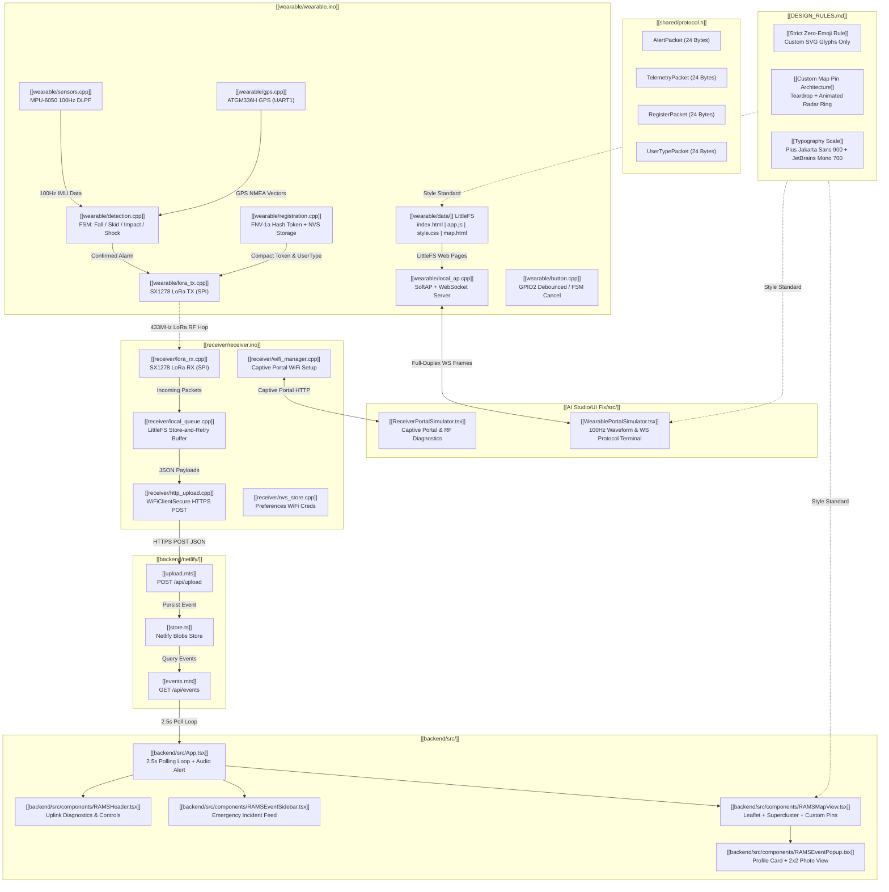

# 🧠 RAMS Master System Memory Map & Graphify Knowledge Base

> **Obsidian Knowledge Graph & Graphify Machine Memory Index**  
> *This file serves as the definitive, zero-token-overhead architectural memory map of the entire RAMS v2 codebase. Any AI agent or developer can navigate this system directly via Obsidian `[[wikilinks]]` without re-scanning files.*

---

## 🕸️ 1. Master System Mermaid Visual Graph (Graphify Compatible)



---

## 🧭 2. Obsidian Wikilink Core Node Index

### Layer 1: Design System & Branding Specifications
- **[[DESIGN_RULES.md]]**: Master architectural UI/UX guidelines:
  - **Prime Directive**: Absolute prohibition of system emojis.
  - **Custom Map Pin Design**: Teardrop SVG (`36px x 46px`) + context-colored radial drop shadow + animated expanding radar ring (`.pin-radar-ring`) + custom vector glyphs (shock `!`, crosshairs, shield check, wrench).
  - **Typography**: Plus Jakarta Sans 900 (Display) + JetBrains Mono 700 (Telemetry & Code).
  - **Spatial Mathematics**: 8pt base grid ($8\text{px}, 16\text{px}, 24\text{px}, 32\text{px}$), outer padding $\ge$ inner padding, nested radius rule $R_{\text{inner}} = R_{\text{outer}} - \text{Padding}$.
  - **Color Palette**: Dark Slate `#09090b` (Deep Canvas), `#121214` (Surface), `#18181b` (Elevated), `#27272a` (Hairline). 4 functional accents (Rose `#ef4444`, Emerald `#10b981`, Amber `#f59e0b`, Sky `#3b82f6`).

### Layer 2: Shared Wireless Protocol
- **[[shared/protocol.h]]**: Single source of truth for over-the-air communication:
  - Radio: 433MHz, SX1278, Spreading Factor 9, Bandwidth 125kHz, Coding Rate 4/7, Sync Word `0x12`.
  - Struct Alignment: Explicit `#pragma pack(push, 1)` guaranteed 24-byte packet envelopes.
  - Packet Types:
    - `PKT_ALERT = 0x01` (`AlertPacket`): Crash/fall impact trigger (`aMag`, `eventType`, `lat`, `lon`, `token`).
    - `PKT_TELEMETRY = 0x02` (`TelemetryPacket`): Live heartbeats (`ax, ay, az`, `battPct`, `fsmState`).
    - `PKT_REGISTER = 0x03` (`RegisterPacket`): Registration token announcement.
    - `PKT_USER_TYPE = 0x04` (`UserTypePacket`): Dynamic road user category switch (`Pedestrian`, `Cyclist`, `Car Driver`, `Motorcycle Rider`).

### Layer 3: Wearable Unit Firmware (`wearable/`)
- **[[wearable/wearable.ino]]**: Main setup and 100Hz execution loop. Orchestrates mode switching between Armed and Setup.
- **[[wearable/config.h]]**: Pin configurations, hardware thresholds, and timing parameters.
- **[[wearable/detection.h]]** & **[[wearable/detection.cpp]]**: 4-stage FSM detection engine (`FS_IDLE` $\to$ `FS_FREEFALL` $\to$ `FS_IMPACT` $\to$ `FS_STILLNESS` $\to$ `FS_CONFIRMED`). Environmental rolling window buffer (`ENV_BUFFER_SIZE = 150`).
- **[[wearable/local_ap.h]]** & **[[wearable/local_ap.cpp]]**: Dedicated WebSocket Server running on port 81 (`WebSocketsServer`) + SoftAP (`RAMS_Setup`). Non-blocking event loop dispatching JSON frames (`register`, `user_type`, `tel`, `gps`, `ping`, `pong`).
- **[[wearable/registration.h]]** & **[[wearable/registration.cpp]]**: NVS flash storage (`Preferences`) for user name (`reg_name`), Google Drive photo link (`reg_drive`), device token (`reg_token`), and road user category (`reg_type`). Generates compact deterministic 16-bit FNV-1a hash tokens (`RAMS-XXXX`).
- **[[wearable/sensors.h]]** & **[[wearable/sensors.cpp]]**: I2C driver for MPU-6050 with hardware DLPF configured for 100Hz sampling.
- **[[wearable/gps.h]]** & **[[wearable/gps.cpp]]**: UART driver for ATGM336H GPS parsing NMEA sentences via `TinyGPSPlus`.
- **[[wearable/lora_tx.h]]** & **[[wearable/lora_tx.cpp]]**: SPI driver for SX1278 transmitting packed 24-byte binary packets.
- **[[wearable/button.h]]** & **[[wearable/button.cpp]]**: Debounced push button handler for alarm cancellation and mode switching.
- **[[wearable/buzzer.h]]** & **[[wearable/buzzer.cpp]]**: Non-blocking pattern generator for active buzzer.
- **[[wearable/neopixel.h]]** & **[[wearable/neopixel.cpp]]**: Onboard RGB LED indicator driver.

### Layer 4: Wearable LittleFS Captive Portal (`wearable/data/`)
- **[[wearable/data/index.html]]**: Master single-page application with 4 views (Setup, Telemetry, Map, WS Logs). Zero emojis, custom inline SVGs for Pedestrian, Cyclist, Car Driver, and Motorcycle Rider.
- **[[wearable/data/app.js]]**: Pure WebSocket client. Connects to `ws://<host>:81/`, handles deterministic hash generation, renders 100Hz canvas accelerometer waveforms, and updates Tuguegarao vector map pins.
- **[[wearable/data/style.css]]**: High-contrast dark theme stylesheet complying with `UI_DESIGN_RULES.md`. Contains `.pin-marker` teardrop styling and `.pin-pulse` radar animations.
- **[[wearable/data/map.html]]**: Standalone route for the Tuguegarao City vector map.
- **[[wearable/data/telemetry.html]]**: Standalone route for live sensor telemetry and waveforms.

### Layer 5: Receiver Base Station Firmware (`receiver/`)
- **[[receiver/receiver.ino]]**: Main receiver loop polling LoRa RX, processing upload retry queues, and serving captive portal.
- **[[receiver/preview_receiver.html]]**: Standalone local browser preview of the Receiver Captive Portal with circular cropped logo and network simulator.
- **[[receiver/data/index.html]]** & **[[receiver/data/style.css]]**: LittleFS captive portal SPA with `.brand-logo-wrap` (50% border radius + circle clip-path) and network scanner.
- **[[receiver/lora_rx.h]]** & **[[receiver/lora_rx.cpp]]**: Continuous LoRa packet listening and deserialization.
- **[[receiver/http_upload.h]]** & **[[receiver/http_upload.cpp]]**: HTTPS client uploading JSON event payloads to Netlify Functions (`/api/upload`).
- **[[receiver/local_queue.h]]** & **[[receiver/local_queue.cpp]]**: Flash-backed LittleFS retry buffer storing events during internet drops.
- **[[receiver/wifi_manager.h]]** & **[[receiver/wifi_manager.cpp]]**: Captive portal fallback for configuring local WiFi credentials with circular logo container and dual image routes.
- **[[receiver/nvs_store.h]]** & **[[receiver/nvs_store.cpp]]**: Encrypted NVS persistence for WiFi SSID and password.

### Layer 6: Cloud Backend (`backend/netlify/`)
- **[[backend/netlify/functions/upload.mts]]**: Serverless endpoint receiving JSON events from receiver base stations.
- **[[backend/netlify/functions/events.mts]]**: Serverless endpoint returning sorted event logs to dashboard clients.
- **[[backend/netlify/functions/store.ts]]**: Netlify Blobs storage wrapper handling atomic event persistence.

### Layer 7: Netlify Web Dashboard (`backend/src/`)
- **[[backend/src/App.tsx]]**: Master dashboard layout with 2.5-second automated polling loop.
- **[[backend/src/components/RAMSMapView.tsx]]**: Interactive Leaflet map with Supercluster aggregation and custom teardrop vector pins.
- **[[backend/src/components/RAMSEventPopup.tsx]]**: Detailed incident card displaying rider photo, emergency contacts, G-force, and map links.
- **[[backend/src/components/RAMSEventSidebar.tsx]]**: Chronological incident timeline with severity filtering.
- **[[backend/src/components/RAMSHeader.tsx]]**: Top operational navigation bar with queue purge, manual ping, and sound toggles.
- **[[backend/src/components/DesignRulesModal.tsx]]**: Interactive reference modal displaying `DESIGN_RULES.md`.

---

## ⚡ 3. Hardware Pinout & Boot Strapping Safety Matrix

| Periphery | ESP32-S3 Pin | Protocol | Notes / Electrical Rules |
| :--- | :--- | :--- | :--- |
| **MPU-6050 SDA** | GPIO4 | I2C Data | 400kHz Fast Mode, external 4.7kΩ pull-up to 3.3V |
| **MPU-6050 SCL** | GPIO5 | I2C Clock | 400kHz Fast Mode, external 4.7kΩ pull-up to 3.3V |
| **GPS TX (ATGM336H)**| GPIO44 (RX1)| UART RX | Receives NMEA 9600 baud sentences |
| **GPS RX (ATGM336H)**| GPIO43 (TX1)| UART TX | Transmits configuration commands |
| **LoRa NSS (CS)** | GPIO10 | SPI CS | Active LOW chip select for SX1278 |
| **LoRa SCK** | GPIO12 | SPI Clock | Up to 10MHz SPI bus clock |
| **LoRa MOSI** | GPIO11 | SPI Data Out | Master Out, Slave In |
| **LoRa MISO** | GPIO13 | SPI Data In | Master In, Slave Out |
| **LoRa DIO0 (IRQ)** | GPIO14 | GPIO Ext Int| Rising edge interrupt on packet RX/TX done |
| **LoRa RST** | GPIO9 | GPIO Output | Active LOW hardware radio reset |
| **Active Buzzer** | GPIO1 | GPIO Output | HIGH = Alarm Tone Active, LOW = Silent |
| **User Push Button** | GPIO2 | GPIO Input | Internal pull-up to 3.3V. Shorted to GND when pressed |
| **NeoPixel RGB LED** | GPIO48 | WS2812B Data| Onboard single addressable RGB LED |

> [!CAUTION]
> **RESERVED BOOT STRAPPING PINS — DO NOT WIRE PERIPHERALS**  
> `GPIO0`, `GPIO3`, `GPIO45`, `GPIO46` are hardware strapping pins on the ESP32-S3. Pulling these pins HIGH or LOW during power-on will prevent the chip from booting or place it into flash download mode.

---

## 📦 4. Over-The-Air Binary Packet Structs (`shared/protocol.h`)

All LoRa packets are packed to single-byte boundaries with zero compiler padding:

```cpp
#pragma pack(push, 1)

// 0x01: Emergency Incident Alert (24 Bytes)
struct AlertPacket {
  uint8_t  pktType;        // 0x01 = PKT_ALERT
  char     token[10];      // e.g. "RAMS-4A2F\0"
  uint8_t  eventType;      // 1=FALL, 2=DIRECT_IMPACT, 3=SKID, 4=GROUND_SHOCK, 5=WAVE_MOTION
  float    latitude;       // WGS84 decimal degrees (4 bytes)
  float    longitude;      // WGS84 decimal degrees (4 bytes)
  float    aMag;           // Peak acceleration magnitude in Gs (4 bytes)
};

// 0x02: Routine Telemetry Stream (24 Bytes)
struct TelemetryPacket {
  uint8_t  pktType;        // 0x02 = PKT_TELEMETRY
  char     token[10];      // e.g. "RAMS-4A2F\0"
  int16_t  ax_mg;          // Acceleration X in milli-g (±2000mg = ±2g)
  int16_t  ay_mg;          // Acceleration Y in milli-g
  int16_t  az_mg;          // Acceleration Z in milli-g
  uint8_t  batteryPct;     // 0-100%
  uint8_t  fsmState;       // 0=IDLE, 1=FREEFALL, 2=IMPACT, 3=STILLNESS, 4=ALARM
  uint16_t seqNum;         // Monotonic counter
};

// 0x04: Road User Category Switch (24 Bytes)
struct UserTypePacket {
  uint8_t  pktType;        // 0x04 = PKT_USER_TYPE
  char     token[10];      // e.g. "RAMS-4A2F\0"
  char     userType[12];   // "Pedestrian", "Cyclist", "Car Driver", "Motorcycle Rider"
  uint8_t  reserved;       // Padding to 24 bytes
};

#pragma pack(pop)
```

---

## 🔄 5. Finite State Machine (FSM) Engine Specifications

```
                     ┌──────────────────┐
                     │   FS_IDLE (0)    │ ◄─────────────────────────┐
                     └────────┬─────────┘                           │
                              │ A_m < 0.40g (Freefall)              │ Stillness
                              ▼                                     │ Timeout
                     ┌──────────────────┐                           │ (> 3.6s)
                     │  FS_FREEFALL (1) │                           │
                     └────────┬─────────┘                           │
                              │ A_m > 3.00g within 100-500ms        │
                              ▼                                     │
                     ┌──────────────────┐                           │
                     │  FS_IMPACT (2)   │                           │
                     └────────┬─────────┘                           │
                              │ Cooldown (400ms)                    │
                              ▼                                     │
                     ┌──────────────────┐                           │
                     │  FS_STILLNESS (3)│ ──────────────────────────┘
                     └────────┬─────────┘
                              │ Standard Deviation σ < 0.25g for 1.2s
                              ▼
                     ┌──────────────────┐
                     │  FS_ALARM (4)    │ ──► Triggers LoRa TX, NeoPixel SOS,
                     └──────────────────┘     Buzzer Alarm, and WebSocket Frame
```

---

## 🌐 6. WebSocket Protocol & NVS Persistence Specification

- **Port**: Dedicated TCP Port 81 (`WebSocketsServer`).
- **Path**: `ws://<host>:81/` (Local AP default IP: `ws://192.168.4.1:81/`).
- **Framing**: JSON RFC 6455 Binary/Text Frames with explicit string termination safety.

### Active Frame Schemas:
1. **Client Register**:
   ```json
   { "type": "register", "name": "...", "driveLink": "...", "userType": "Cyclist", "token": "RAMS-4A2F" }
   ```
2. **Server Registration Result**:
   ```json
   { "type": "register_result", "success": true, "token": "RAMS-4A2F" }
   ```
3. **Client Category Update**:
   ```json
   { "type": "user_type", "userType": "Motorcycle Rider", "name": "...", "token": "RAMS-4A2F" }
   ```
4. **Server Live Telemetry Stream**:
   ```json
   { "type": "tel", "ax": 0.04, "ay": -0.02, "az": 0.99, "gx": 1.2, "gy": -0.8, "gz": 0.4, "am": 1.00, "fsm": 0 }
   ```
5. **Server GPS Fix Frame**:
   ```json
   { "type": "gps", "lat": 17.6132, "lon": 121.7269, "sats": 9, "fix": true }
   ```

### NVS Flash Storage Keys (`namespace: "rams_reg"`):
| Key | Type | Purpose | Example |
| :--- | :--- | :--- | :--- |
| `reg_name` | String | Road User Full Name | `"Jane Doe"` |
| `reg_drive` | String | Google Drive 2x2 Photo URL | `"https://drive.google.com/file/d/..."` |
| `reg_token` | String | Compact FNV-1a Hash Token | `"RAMS-4A2F"` |
| `reg_type` | String | Road User Category | `"Cyclist"` |

---

## 🗺️ 7. Tuguegarao City Vector Map Spatial Calibration

The offline map engine uses an SVG vector coordinate transform matching Tuguegarao City's geographic bounding box:

$$\text{Top Lat} = 17.625^\circ\text{N}, \quad \text{Bottom Lat} = 17.600^\circ\text{N}$$
$$\text{Left Lon} = 121.715^\circ\text{E}, \quad \text{Right Lon} = 121.740^\circ\text{E}$$

### Coordinate Mapping Formulas:
$$X\% = \text{clamp}\left(5, 95, \frac{\text{lon} - 121.715}{121.740 - 121.715} \times 100\right)$$
$$Y\% = \text{clamp}\left(5, 95, \frac{17.625 - \text{lat}}{17.625 - 17.600} \times 100\right)$$

> [!IMPORTANT]
> **Map Pin Conditional Rendering**:
> - If `fix === false` or `lat <= 0`: The pin element (`#mapPin`) is **strictly hidden** (`display: none`). Only the city overview with the status badge `NO GPS FIX • TUGUEGARAO OVERVIEW (NO PIN PLACED)` is rendered.
> - If `fix === true` and `lat > 0`: The teardrop pin with pulsing beacon (`.pin-pulse`) appears at calculated $(X\%, Y\%)$.

---

## ⚡ 8. AI Agent Fast Query Index (Zero-Scan Reference)

| Developer Question | Authoritative File Target | Key Function / Symbol |
| :--- | :--- | :--- |
| **Where is the fall/skid detection logic?** | [[wearable/detection.cpp]] | `detectionUpdate()` |
| **Where are detection thresholds defined?** | [[wearable/config.h]] | `FALL_FREEFALL_G`, `FALL_IMPACT_G` |
| **Where are LoRa packet structs defined?** | [[shared/protocol.h]] | `AlertPacket`, `TelemetryPacket` |
| **How is the compact token generated?** | [[wearable/registration.cpp]] & [[wearable/data/app.js]] | `registrationGenerateToken()`, `generateFriendlyToken()` |
| **Where is the dedicated WebSocket handler?** | [[wearable/local_ap.cpp]] | `_onWsEvent()`, `WebSocketsServer` |
| **Where is the user category saved to NVS?** | [[wearable/registration.cpp]] | `registrationSetUserType()` |
| **Where is the custom teardrop map pin?** | [[backend/src/components/RAMSMapView.tsx]] | `createAestheticMarkerIcon()` |
| **Where are the UI design & zero-emoji rules?**| [[DESIGN_RULES.md]] | Master Design Rules Document |
| **Where is the offline LittleFS portal markup?**| [[wearable/data/index.html]] | Full 4-tab SPA interface |
| **Where is the receiver upload queue logic?** | [[receiver/local_queue.cpp]] | `localQueueAdd()`, `localQueueProcess()` |
| **Where are Netlify Blob CRUD helpers?** | [[backend/netlify/functions/store.ts]] | `saveEvent()`, `getEvents()` |
