# 🧠 GuardianTrack — Obsidian System Memory & Graph Map

> **Obsidian Knowledge Graph & Technical Reference Document**  
> *Interconnected architectural memory map, node links, hardware pinouts, protocol packet layouts, backend specs, and network configurations for the GuardianTrack system.*

---

## 🕸️ 1. Master System Mermaid Visual Graph

```mermaid
graph TD
    %% Hardware Nodes
    subgraph Wearable_Hardware["[[Wearable ESP32-S3 SuperMini]]"]
        GPS["[[NEO-6M GPS]]<br/>UART0: GPIO43 TX / GPIO44 RX"]
        BTN["[[Tactile Button]]<br/>GPIO5 (Internal Pull-Up)"]
        MIC_A["[[I2S Digital Mic (Plan A)]]<br/>GPIO6 BCLK | GPIO7 WS | GPIO8 SD"]
        MIC_B["[[Electret + LM358 Preamp (Plan B)]]<br/>GPIO4 (ADC1_CH3)"]
        BAT["[[LiPo Battery]]<br/>Onboard BAT+/BAT- Charge IC"]
    end

    subgraph Receiver_Hardware["[[Receiver ESP32-S3 Base Station]]"]
        RX_RADIO["[[ESP-NOW & WiFi STA Radio]]<br/>Channel Sync with Router"]
        RX_PWR["[[USB-C 5V Power Supply]]"]
        RX_QUEUE["[[NVS / Flash Local Queue]]<br/>Store-and-Retry Handler"]
    end

    subgraph Wireless_Link["[[ESP-NOW Protocol]]"]
        ESP_NOW_LINK["Fixed Channel ESP-NOW Packet Hop<br/>(Wearable → Receiver)"]
    end

    subgraph Backend_Cloud["[[Netlify Cloud & Dev Backend]]"]
        API_UP["[[Upload Function]]<br/>/api/upload"]
        API_EV["[[Events Function]]<br/>/api/events"]
        BLOB_STORE["[[Netlify Blobs]]<br/>Audio WAV/PCM Storage"]
        NTFY_SYS["[[ntfy Push Notifications]]<br/>https://ntfy.sh/gps-audio-notifications"]
    end

    subgraph Clients["[[Parent Monitoring Applications]]"]
        DASH["[[Parent Web Dashboard]]<br/>Index.html + App.js + Leaflet Map"]
        PHONE["[[Parent Mobile Device]]<br/>Instant Alert Notification"]
    end

    %% Connections
    BTN -->|3-Click: Start Rec<br/>Hold 1s: Stop & Send| Wearable_Hardware
    GPS -->|NMEA Location Data| Wearable_Hardware
    MIC_A -->|Digital I2S Audio| Wearable_Hardware
    MIC_B -->|Analog Voice Band| Wearable_Hardware
    BAT -->|3.7V Power| Wearable_Hardware

    Wearable_Hardware -->|Chunked Audio + Telemetry Packets| ESP_NOW_LINK
    ESP_NOW_LINK -->|Sequence Reassembly| RX_RADIO
    RX_RADIO -->|HTTPS POST Payload| API_UP
    RX_RADIO -.->|If Offline: Save| RX_QUEUE

    API_UP -->|Persist Audio Clip| BLOB_STORE
    API_UP -->|Publish Event| API_EV
    API_UP -->|Trigger Alert| NTFY_SYS

    API_EV -->|Fetch Events & Audio Links| DASH
    NTFY_SYS -->|Push Notification with Map Link| PHONE
```



---

## 🔗 2. Obsidian Wikilink Core Node Index

Use these [[Wikilinks]] inside Obsidian to navigate the system knowledge graph:

- [[Wearable ESP32-S3]] — Body-worn tracking & audio recording firmware.
- [[Receiver ESP32-S3]] — Autonomous base station relaying data over Wi-Fi/HTTPS with in-place zero-allocation WAV assembly and direct HTTP socket streaming.
- [[ESP-NOW Protocol]] — Low-latency 2.4GHz custom packet protocol.
- [[Hardware Pin Mapping]] — Complete GPIO assignment breakdown & strapping pin safety.
- [[Dual Microphone Architecture]] — Active: KY-038 Microphone Module (`MIC_SOURCE_KY038_ANALOG` on GPIO4 `A0` pin with auto-tracking trimmer bias & $64\times$ voice boost). Plan A (I2S Digital INMP441) and Plan B (Custom Analog) optional.
- [[Netlify Dev Backend]] — Serverless Netlify Functions (`upload.mts`, `events.mts`).
- [[Netlify Blobs Storage]] — Persistent audio storage bucket for recorded voice clips.
- [[Local Debugging & IP Config]] — LAN endpoint configuration (`http://192.168.123.6:8888`).
- [[Parent Dashboard UI]] — Live Leaflet map, audio player, and event log UI.

---

## 📌 3. Hardware Pin Mapping & Boot Strapping Safety Matrix

### 3.1 [[Wearable ESP32-S3]] Pinout
| Peripheral | Pin Label | ESP32-S3 GPIO | Subsystem / Wiring Rule |
| :--- | :--- | :--- | :--- |
| **GPS (NEO-6M) TX** | RX Silkscreen | **GPIO44** | UART0 RX (Cross-connected: GPS TX → ESP32 RX) |
| **GPS (NEO-6M) RX** | TX Silkscreen | **GPIO43** | UART0 TX (Cross-connected: GPS RX → ESP32 TX) |
| **Trigger Button** | Input | **GPIO5** | Debounced via `OneButton` (3-click record, long-press send) |
| **Plan A Digital Mic (INMP441/MH-ET)** | BCLK | **GPIO6** | I2S Bit Clock |
| | WS / LRCLK | **GPIO7** | I2S Word Select |
| | SD | **GPIO8** | I2S Serial Data Out |
| | L/R Select | **GND** | Left channel (Mono) |
| **Plan B Analog Mic (Electret+LM358)**| OUT | **GPIO4** | **ADC1_CH3** *(Must be ADC1; ADC2 is disabled by Wi-Fi)* |
| **Power Input** | BAT+ / BAT- | **Dedicated Pads**| Direct connect to 3.7V LiPo with onboard TP4056 charge IC |

### 3.2 ⛔ Reserved Boot Strapping Pins (DO NOT WIRE PERIPHERALS)
> [!CAUTION]
> **Forbidden GPIOs at boot time:**
> - **GPIO0** — Boot mode select (High = Flash execution, Low = Download mode).
> - **GPIO3** — JTAG / Boot option.
> - **GPIO45** — VDD_SPI voltage selection (1.8V vs 3.3V power domain).
> - **GPIO46** — Boot log output control.

---

## 📡 4. [[ESP-NOW Protocol]] Specification

### 4.1 Channel Synchronisation Rule
```text
Router (Wi-Fi AP) ──(Assigns Channel X)──► Receiver ESP32-S3 (Wi-Fi STA)
                                                │
                                    (Reads Channel X & Sets ESP-NOW)
                                                │
                                                ▼
Wearable ESP32-S3 ──(esp_wifi_set_channel(X))──► ESP-NOW Direct Hop
```

### 4.2 Packet Headers & Payload Structs
```cpp
// Packet Types
#define PACKET_TYPE_TELEMETRY   0   // GPS Location only
#define PACKET_TYPE_AUDIO_CHUNK 1   // Audio PCM/ADPCM data slice
#define PACKET_TYPE_AUDIO_END   2   // End of recording signal

// Header format (Common to all packets)
struct Header {
    uint8_t  packet_type;   // 0, 1, or 2
    uint16_t sequence_num;  // Reassembly index
    uint32_t timestamp;     // Milliseconds tick
};

// Audio Chunk Payload (Type 1)
struct AudioChunkPacket {
    Header   header;
    uint16_t chunk_len;
    uint8_t  data[200];     // Max payload slice
};

// Telemetry & Audio End Payload (Type 0 & 2)
struct TelemetryPacket {
    Header   header;
    float    latitude;
    float    longitude;
    uint8_t  battery_pct;
};
```

---

## 🌐 5. [[Netlify Dev Backend]] & [[Local Debugging & IP Config]]

### 5.1 Local LAN Debugging Configuration
* **Config File:** [receiver/config.h](file:///d:/Antigravity/Projects/GPS_Audio/GPS-Audio/receiver/config.h#L28)
* **Local LAN Endpoint:** `http://192.168.123.6:8888`
* **Production Endpoint:** `https://gps-audio.netlify.app`
* **ntfy Topic:** `https://ntfy.sh/gps-audio-notifications`

### 5.2 Endpoint Routing Matrix
| Route | Method | Handler File | Purpose |
| :--- | :--- | :--- | :--- |
| `/api/upload` | `POST` | [upload.mts](file:///d:/Antigravity/Projects/GPS_Audio/GPS-Audio/backend/netlify/functions/upload.mts) | Receives JSON payload with GPS + Base64 audio; saves to Netlify Blobs & triggers ntfy notification |
| `/api/events` | `GET / DELETE` | [events.mts](file:///d:/Antigravity/Projects/GPS_Audio/GPS-Audio/backend/netlify/functions/events.mts) | Returns JSON list of recent emergency events and audio download URLs; `DELETE` / `?clear=true` purges system memory |
| `/clear-memory` | `POST` | [local_queue.cpp](file:///d:/Antigravity/Projects/GPS_Audio/GPS-Audio/receiver/local_queue.cpp) | Receiver endpoint to clear pending queued flash items |
| `/` | `GET` | [index.html](file:///d:/Antigravity/Projects/GPS_Audio/GPS-Audio/backend/public/index.html) | Parent Dashboard web UI |

---

## 🛠️ 6. Local Server & Debugging Runbook

### Starting the Local Development Server
To launch the Netlify local backend dev server for testing:

```powershell
cd "d:\Antigravity\Projects\GPS_Audio\GPS-Audio\backend"
npm run dev
```

* **Server Output:** Runs on port `8888`.
* **Testing API with Curl:**
  ```powershell
  curl http://192.168.123.6:8888/api/events
  ```

---

## 🐞 8. Serial Monitor Live Audio & Hardware Diagnostics

When operating the Wearable device, open Arduino IDE Serial Monitor at **115200 baud**.

### Diagnostic Log Indicators
| Event | Serial Output Log Format | Verification Meaning |
| :--- | :--- | :--- |
| **Raw Pin Debugger** | `[RAW GPIO5] 🔽 Button Pressed -> Shorted to GND (LOW)` | Pin 5 physical electrical state transition |
| **Button Test (1 Click)** | `[BTN] Single-click detected on GPIO5!` | OneButton click algorithm registered 1 click |
| **Start Rec (3 Clicks)** | `[BTN] Triple-click detected → START RECORDING`<br/>`[AUDIO] Capture task activated` | Audio task started recording |
| **Live VU Meter (Rec)** | `[REC] 2.5s \| 40000 / 480000 bytes \| Peak: 4820 [\|\|\|\|......]` | Mic capturing voice audio on GPIO4 (ADC1_CH3) |
| **Stop & Send (Long Press)**| `[MAIN] 📡 Sending audio + GPS via ESP-NOW...`<br/>`[ENOW] Sending 480000 bytes in 2400 chunks...`<br/>`[ENOW] Audio send complete!` | Packet transmission to Receiver base station |

```text
GPS_Audio/
├── Docs/                              # KiCad Schematic & PDF Diagrams
├── MD Files/                          # System Specifications & Memory Maps
│   ├── OBSIDIAN_SYSTEM_MEMORY_MAP.md  # (THIS DOCUMENT)
│   ├── GuardianTrack_Master_Build_Spec.md
│   ├── PIN_CONNECTIONS.md
│   └── LOCAL_TESTING_GUIDE.md
└── GPS-Audio/
    ├── wearable/                      # ESP32-S3 Wearable Firmware
    │   ├── config.h                   # Wearable pin definitions & audio choices
    │   ├── espnow_tx.cpp              # ESP-NOW transmitter logic
    │   ├── gps.cpp                    # NEO-6M UART parser
    │   └── mic_capture.cpp            # I2S / ADC Dual Mic abstraction
    ├── receiver/                      # ESP32-S3 Receiver Firmware
    │   ├── config.h                   # BACKEND_URL & Wi-Fi settings
    │   ├── espnow_rx.cpp              # Packet reassembly handler
    │   ├── http_upload.cpp            # HTTPS backend uploader
    │   └── local_queue.cpp            # Store-and-retry NVS buffer
    └── backend/                       # Serverless Netlify Backend & Web UI
        ├── netlify/functions/
        │   ├── upload.mts             # Audio upload handler
        │   └── events.mts             # Event query handler
        ├── public/                    # Web App static files (HTML/JS/CSS)
        └── package.json               # Backend npm package definition
```
